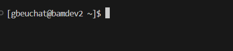
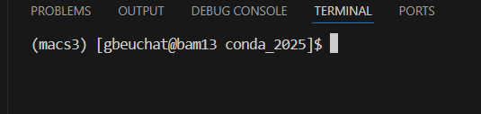
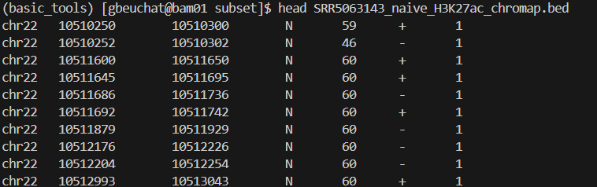
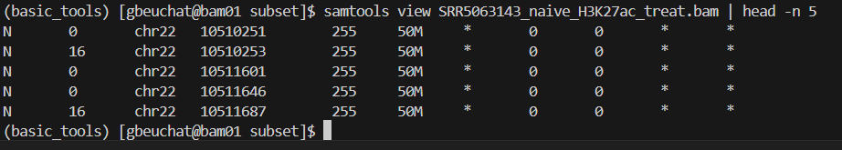
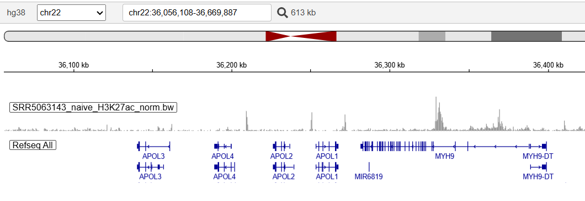
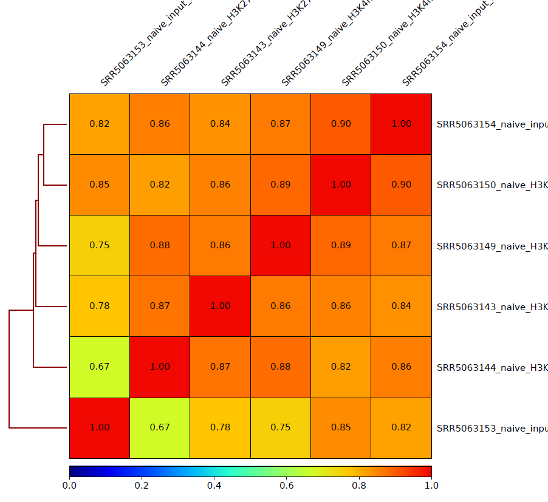
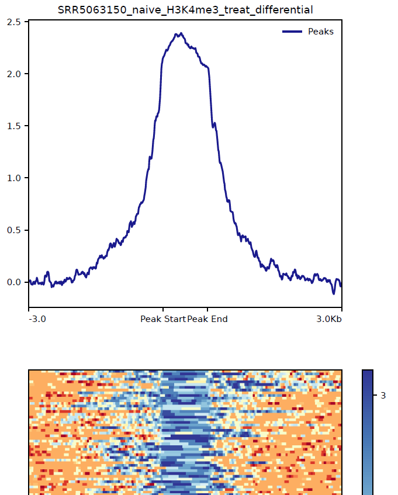

# CSHL Fall 2025 Computational Genomics Course
Welcome! This is the material and tutorials for the Chromatin Workshop.
The database adopted in this course is under the reference: "Enhancer Chromatin and 3D Genome Architecture Changes from Naive to Primed Human Embryonic Stem Cell States". https://www.sciencedirect.com/science/article/pii/S2213671119301262?via%3Dihub <br />

## Outline:
1) FastQC and MultiQC <br />
2) Map Your Reads <br />
3) Post Map Processing <br />
4) Data Visualization via Genome Browser <br />
5) Calling Peaks <br />
6) QC Peaks (FRiP Scores) <br />
7) Data Visualization via deepTools <br />
8) Bedtools! <br />
9) Combine Replicates For Cohesive Comparison <br />
<br>*For your reference later but pre-done for us now.*
10) Setting Up Conda <br />

### Data info:
- **Cell Type**: Naive cells <br />
- **Histone modification**: H3K4me3: *Promoters* & H3K27ac: *Promoters and Enhancers* <br />
- **Library info**: **1)** SE-fastq files; **2)** 3 M reads <br />
- **Data File**: Total 6 files (2 for each histone modification & 2 input files) <br />
##

### Tools and Packages Required: <br />
- deepTools: https://deepTools.readthedocs.io/en/develop  <br />
- Samtools: https://www.htslib.org/  <br />
- Chromap: https://github.com/haowenz/chromap <br />
- bedtools: https://bedtools.readthedocs.io/en/latest/  <br />
- MACS2: https://pypi.org/project/MACS2/  <br />

## 0) Interactive Session and File Setup

- The data is miniaturized, so we can run it in real time using an interactive session. <br />

- Scripts are still provided for all of these in the directory. <br />

- This works the same way as submitting a script, but in one line and srun (for slurm) <br />

`srun -N 1 --ntasks 8 --mem 40gb --pty bash`
- Now we will launch conda, which I installed on the server earlier<br>(commands for this are at the bottom of this page)<br />

`source /grid/genomicscourse/home/shared/conda_2025/miniconda3/bin/activate`

- Now we will copy the files from the shared directory <br> to your own directory to play with. <br />

`cp -r /grid/genomicscourse/home/shared/CSHL_Chromatin_Workshop_2025 ~`


### Troubleshooting in the future (of this workshop)
It's very possible that you will get *disconnected* from the server momentarily, just going by precedent.
If that happens: ***you will need to run the above qlogin and source commands again to relaunch conda.***

Even if you do not get disconnected, it may be a good idea to double check that you are still in the interactive session and still with conda running. You can do this by checking what the prompt says on your terminal.

If conda is *not* running and you are *not* connected to an interactive session, it will look like this:


If conda *is* running and you *are* connected to an interactive session, it will look like this:


## 1) FastQC and MultiQC
- **Documentation**: *FastQC*: https://www.bioinformatics.babraham.ac.uk/projects/fastqc/ & *MultiQC*: https://multiqc.info/ <br />
```bash
#activate the relevant conda environment

conda activate multiqc

#go to the right directory
cd ~/CSHL_Chromatin_Workshop_2025/data/subset/

#FastQC: ~3 -4 min total. 
#this will run for every file that ends in .fastq

fastqc *.fastq

#MultiQC: ~ 1 min
#this will run only once but use every .zip file
#and combine them into a report

multiqc *.zip
```

## 2) Map Your Reads

In this section we will build a genome index and do the basic alignment<br />

### 2.1) Reference Genome

As with everything in this workshop we will be using only a small portion of the genome.<br>

We will be using **Chromosome 22** of the human genome assembly **GRCh38.p14**<br>
Chromosome 22 info (just for fun): https://useast.ensembl.org/Homo_sapiens/Location/Chromosome?r=22 <br />

However we will not be using only the plain FASTA<br>
Like most aligners **Chromap** uses a genome index to align, not the genome itself,<br>
and we will need to build that first.

```bash
conda activate chromap
cd ~/CSHL_Chromatin_Workshop_2025/genome/
#this will build the index from the genome, and call it "index"
chromap -i -r hg38_chr22.fa -o index
```
- Flags:<br>
**-i**: indexing genome<br>
**-r**: reference genome<br>
**-o**: output name<br>


### 2.2) Mapping Data 
- Chromap: *~35 sec* <br />

**Chromap** https://github.com/haowenz/chromap for aligning and preprocessing high throughput chromatin profiles (*ATAC-seq & ChIP-seq*):

This is a speedy and minimal aligner that is convenient for a workshop like this one.
However, if you need to do downstream analysis like calling variants etc, you
will need to use a differet aligner that keeps read information.
In addition, chromap has a lot of convenient functionality that you will need to do separately,
like trimming the reads and removing duplicates.
***If you use a different aligner you will need to do those steps yourself.***

Chromap will do three things for us:

**1)** Trim the low-quality reads and adapters
**2)** Remove duplicated reads
**3)** Perform the mapping. <br />

```bash
#THESE ARE NOT ABSOLUTE PATHS YOU NEED TO ADD TO THEM
cd ~/CSHL_Chromatin_Workshop_2025
datadir=$(pwd)
dir="${datadir}/data/subset"
genome=${datadir}/genome/hg38_chr22.fa #genome
index=${datadir}/genome/index #index
list=${datadir}/data/subset/sample.txt

#source /grid/genomicscourse/home/shared/conda_2025/miniconda3/bin/activate
conda activate chromap

cd $dir
for SAMPLE_ID in `cat $list`; do
# map using chromap, output is bed file
chromap --preset chip -x $index -r $genome -q 20 --min-read-length 10   -1  ${SAMPLE_ID}.fastq  -o  ${SAMPLE_ID}_chromap.bed
done
conda activate basic_tools
#dos2unix basically just converts all the End Of Line (EOL) marker from DOS/Windows format to unix, so from \r\n to \n
#the reason this is here is just because when I tried to run "convert to bam" later, there was an error that was fixed by this.
dos2unix *.bed
```
- Flags:
**--preset chip**:Mapping chip reads<br>
**-x**:index<br>
**-r**:reference genome<br> 
**-q**:Min MAPQ (*Quality*)<br>
**--min-read-length**:min length read<br>
**-1**:Single-end (*include -2,implies they need both -1 and -2*)<br> 
**-o**: output file<br>
*--trim-adapters(not used)*<br>

**check files**: Output file (*BED format*) <br /> 

`head SRR5063143_naive_H3K27ac_chromap.bed` <br />
Should look like this:<br>


## 3) Post Map Processing 
- Convert bed to bam *~2sec* <br /> 
- A note that these BAM files will be lacking many important components, but are usable for peak calling.

**MUST!!** use the same version of reference genome used in the analysis <br />

Before you can convert to bams, you will need to calculate the size of each chromosome. <br />
We are only using chromosome 22, but the same commands will work with any genome.

These commands will complain in this context that samtools needs version information and our genome does not have it.<br>
Although this is true it will still generate the sizes.genome file we are looking for.

```bash
cd ~/CSHL_Chromatin_Workshop_2025
datadir=$(pwd)
cd ${datadir}/genome
conda activate basic_tools
samtools faidx hg38_chr22.fa
cut -f1,2 hg38_chr22.fa.fai > sizes.genome
cat sizes.genome
``` 


Now you can actually convert to the bam files for peak calling.
```bash
#THESE ARE INCOMPLETE PATHS, YOU NEED TO ADD TO THEIR BEGINNING
cd ~/CSHL_Chromatin_Workshop_2025
datadir=$(pwd)
dir=${datadir}/data/subset
genome=${datadir}/genome/hg38_chr22.fa #genome
index=${datadir}/genome/index #index
list=${datadir}/data/subset/sample.txt
size=${datadir}/genome/sizes.genome #size of chrm
##

cd $dir

# source /grid/genomicscourse/home/shared/conda_2025/miniconda3/bin/activate
conda activate basic_tools

#list was previously set in the variables at the beginning as "sample.txt" and is a file that contains library names one per line.
# the backticks tells unix to run whatever is inside them and replace the spot in the line with the output.
# it then assings those to SAMPLE_ID, once for each time in the loop.
#for each of those it uses bedtools to convert them to bam.
for SAMPLE_ID in `cat $list`; do
#convert alignments to BAM
        bedtools bedtobam  -i ${SAMPLE_ID}_chromap.bed -g $size > ${SAMPLE_ID}_chromap.bam #input files are the same from chromap
done
```


- Sort **.bam**, generate indexes **.bai**, & generate **.bw** *(BigWigs)* *~3min*  <br />
```bash
cd ~/CSHL_Chromatin_Workshop_2025
datadir=$(pwd)
dir=${datadir}/data/subset
genome=${datadir}/genome/hg38_chr22.fa #genome
index=${datadir}/genome/index #index
list=${datadir}/data/subset/sample.txt
size=${datadir}/genome/sizes.genome #size of chrm
##
cd $dir

#source miniconda3/bin/activate
conda activate basic_tools

for SAMPLE_ID in `cat sample.txt`; do
##sort
  samtools sort ${SAMPLE_ID}_chromap.bam -@ ${SLURM_CPUS_ON_NODE}  -o ${SAMPLE_ID}_treat.bam
##convert to bw
  samtools index ${SAMPLE_ID}_treat.bam
  conda activate deepTools
  bamCoverage -p max -b ${SAMPLE_ID}_treat.bam  --normalizeUsing RPKM  -v  -o ${SAMPLE_ID}_norm.bw ##you can use this on the genome browser
  #normalizing is usually a good idea so you can compare the bigwigs to each other, RPKM is the standard method people use but there are others
    #with strengths and weaknesses, google will help you here.
  conda activate basic_tools
done
```

**You do NOT need to run the following section**
If you are using a complete genome, as you will be in your own research, you will want to
remove reads that mapped to the mitochondria (or the chloroplasts), as well as probably most of the
contigs, as these portions of the genome tend to respond differently to chromatin based assays.
You can do this with the following commands (for mitochondria):<br />

```bash
## Hi don't run me.
samtools index ${sorted.bam.file} 
samtools idxstats ${sorted.bam.file} | cut -f1 | grep -v Mt | xargs samtools view -b ${sorted.bam.file}  > ${sorted-noMT.bam.file}
```
## 4) Data Visualization via Genome Browser

**Check your output files:**

- To check the **BAM** files just unzip it using samtools and print the first five lines:
`samtools view SRR5063143_naive_H3K27ac_treat.bam | head -n 5` <br />
Should look like this:



- To check the **BigWig** files you will need a genome browser:
- First download the *.bw files from the HPC to your personal PC *can use SCP or STFP* <br>
***Whatever method to get files onto your computer is fine*** <br />

- Then we'll use the IGV app: https://igv.org/app/  <br />
- Select the hg38 genome and select the chromosome 22 *(chr22)* <br />
- upload the *.bw in the *track* function  <br />
- Let's have fun!! check the **FBXO7** gene  <br />
  *https://useast.ensembl.org/Homo_sapiens/Gene/Summary?g=ENSG00000100225;r=22:32474676-32498829
  *chr22:32474676-32498829   <br />

Should look like this:



*General Advice: a really good fast way to check files is to check their size*<br>
*For text based files, like peak files etc, you can count the number of lines to<br>
*make sure they make sense. You can do this with:*<br>
`wc -l ${your_file}`
*For binary files like BAM files, you can check file size using:*<br>
`ls -sh ${your_file}`
*Try it if something is being odd!*

## 5) Calling Peaks 
- MACS3: *~2 min* <br />  

**MACS3** the Model-based Analysis of ChIP-Seq (MACS) for chormatin data analysis https://pypi.org/project/MACS3/ <br />
**Analysis for ChIP-seq; ATAC-seq; Cut&Tag**. *The parameters depend on the data type.*  <br />

- Histone modification" *H3K27ac:* broad peaks; *H3K4me3* narrow peaks. <br />   


```bash
cd ~/CSHL_Chromatin_Workshop_2025
datadir=$(pwd)
dir=${datadir}/data/subset
genome=${datadir}/genome/hg38_chr22.fa #genome
index=${datadir}/genome/index #index
list=${datadir}/data/subset/sample.txt
size=${datadir}/genome/sizes.genome #size of chrm
##
cd $dir

#source /grid/genomicscourse/home/shared/conda_2025/miniconda3/bin/activate
conda activate macs3

input_combinations_broad=(
"SRR5063143_naive_H3K27ac_treat.bam,SRR5063153_naive_input_treat.bam"
"SRR5063144_naive_H3K27ac_treat.bam,SRR5063154_naive_input_treat.bam"
)

input_combinations_narrow=(
"SRR5063149_naive_H3K4me3_treat.bam,SRR5063153_naive_input_treat.bam"
"SRR5063150_naive_H3K4me3_treat.bam,SRR5063154_naive_input_treat.bam"
)


for files in ${input_combinations_broad[@]}; do

#the below line is handy for reading in tables, for example. In this case the "table" is generated
#in the previous lines, but you could imagine them written as a comma-separated file like a .csv
    #the <<< is basically telling unix to run whatever is to the left of it on whatever is to the right of it.
    #IFS stands for Internal Field Separator, and is just a way to tell unix the delimiter it should use to split
    #the input. read -r is used to take input from the user and assign it to a variable (or more).
    #because you are running it before the <<< you are telling read to treat $files as the user input and assign it to
    #variables $file1 and $file2, and to split it based on the IFS of ','

IFS=',' read -r file1 file2 <<< $files
##macs2-broad
macs3 callpeak  -t  $file1 -c $file2 \
        -f BAM  -g 50818468 --nomodel --shift -100 --extsize 200 \
        -n ${file1%_treat.bam} --broad \
        --outdir . 2> ${file1%_treat.bam}_broad_macs3.log
done

#macs3 will call peaks based on your bam(s). for more detail you can look at the macs manuals.
    #in this specific case we are telling it to use the human genome size with -g hs, we are telling it
    #not to make a model of the binding, because there are some assays that result in reads offset from
    #the actual site of binding for whatever you are testing for, but chip seq on histone modifications
    #is not one of them. (chip seq on transcription factors is, though)
    #instead we are going to manually shift and extend the read to make up for the fact that we are using single end
    #data instead of paired end data, so that we can have a longer insert sizes around the place we are sequencing.
    #--outdir . is just a way unix uses to say "the current directory" or in the case of moving files "the current file name."
    #the 2> *.log is telling the command to redirect the error logs to that file.

    #In this specific case, we need to provide the -c control bam, but not all assays require this. All chip seq does but
    #for example ATACseq does not. If you simply do no include a -c flag and file it will not use one.

for files in ${input_combinations_narrow[@]}; do

IFS=',' read -r file1 file2 <<< $files
##macs2-narrow
macs3 callpeak  -t  $file1 -c $file2 \
        -f BAM  -g 50818468  --shift -100 --extsize 200 \
        -n ${file1%_treat.bam}  \
        --outdir . 2> ${file1%_treat.bam}_narrow_macs3.log

done

#MACS outputs the peak files in .narrowPeak or .broadPeak format.
#I would usually recommend clearly keeping the labels on these so you don't lose track,
#but for downstream convenience we will rename them today.
for peakfile in `ls *.broadPeak`
do
mv ${peakfile} ${peakfile//\.broadPeak/\.Peak}
done

for peakfile in `ls *.narrowPeak`
do
mv ${peakfile} ${peakfile//\.narrowPeak/\.Peak}
done

#just to check how many peaks we got!
wc -l *.Peak

```

## 6) QC Peaks (FRiP Scores) 
- bedtools and samtools: *~ 3 min* <br />

**Fraction of reads in peaks (FRiP):** FRiP Score is used to evaluate the library's quality, in terms of noise. <br>
 *more details:* https://yiweiniu.github.io/blog/2019/03/Calculate-FRiP-score/ <br />

- You will need: **BAM** files & **Peaks (BED)** files. <br />

```bash
cd ~/CSHL_Chromatin_Workshop_2025
datadir=$(pwd)
dir=${datadir}/data/subset
genome=${datadir}/genome/hg38_chr22.fa #genome
index=${datadir}/genome/index #index
list=${datadir}/data/subset/sample.txt
size=${datadir}/genome/sizes.genome #size of chrm
##
cd $dir

conda activate basic_tools

#this line should return an error the first time you run it, that's okay it's just to clear any 
#existing report files since the >> appends to the file but does not replace it.
rm FRiP_Scores_Report.txt

for peakfile in `ls *.Peak`; do
#the command in the tickmarks this time lists every file that ends with .Peak

readfile=${peakfile//_peaks.Peak/_treat.bam}
#this line calls the variable $peakfile you just made, finds _peaks.Peak within it,
    #and replaces it with _treat.bam,
    #which are the reads that made up the peak file.

reads=$(samtools view -c ${readfile})
#samtools view -c just counts the number of reads in the sam/bam file
reads_peaks=$(bedtools intersect -u -a ${readfile} -b ${peakfile} -ubam | samtools view -c)
#the bedtools intersect tells you the reads in -a that intersect with the peaks in -b,
    #the -u and -ubam flag means it should be printed as an unsorted bam,
    #then the samtools view -c counts THOSE to get the reads in peaks
frip_score=$(echo "scale = 6; ${reads_peaks} / ${reads}" | bc)
#to get the frip score we just divide one by the other. The only complication is that
    #bash does not deal with floating point numbers (numbers that have decimals on them)
    #so a simple $reads / $reads_peaks won't work. Instead we need to pass the expression through
    #a pipe to bc, which can. we do this by building our expression and printing it with echo.
    #scale = 6 is saying we should calculate and print to 6 decimal places.

echo -e "${peakfile//_peaks.Peak/}\t${frip_score}" >> FRiP_Scores_Report.txt
#this line just prints the name of the library (so peakfile but without the _peaks.Peak ending)
    #and the frip score separated by a tab.
done
#this line just prints out the report.
cat FRiP_Scores_Report.txt
``` 

These FRiP values are terrible! Usually we would want a FRiP score of at least .2 or so. <br />
However, these are very subsampled, and only one chromosome is present, so it will be good for now.

## 7) Data Visualization via deepTools
- deepTools: *~ 20 min* <br />

We're going to make two types of plots to broadly visualize our results. First we will make a correlation grid
for the samples, which helps us to see if the samples we expect to be similar are indeed similar.

The second type of plot is a heatmap of the signal strength centered on our peaks (or other things we might check for)
which lets us see the shape of our peaks and how consistent the signal is across the genome.

```bash
cd ~/CSHL_Chromatin_Workshop_2025
datadir=$(pwd)
dir=${datadir}/data/subset

cd ${dir}
mkdir -p consensus_matrixes/
mkdir -p deepTools_graphs/

#source /grid/genomicscourse/home/shared/conda_2025/miniconda3/bin/activate
conda activate deepTools

multiBigwigSummary bins -b *norm.bw -o bw_corr.npz -p ${SLURM_CPUS_ON_NODE}
#the above command takes all the bigwigs listed after -b separated by a space (automatically done here
    #with the *norm.bw), splits them into bins, figures out the pairwise correlations for each bin for each bigwig
    #averages the correlation among all the bin pairwise comparisons for each bigwig (so you get one correlation
    #value for each bigwig to bigwig comparison) and stores that in the output matrix.
    #-p ${SLURM_CPUS_ON_NODE} is for the number of parallel threads available to speed this calculation up.

plotCorrelation -in bw_corr.npz -c spearman -p heatmap --plotNumbers -o deepTools_graphs/correlation_heatmap.pdf
#plotCorrelation -in bw_corr.npz -c spearman -p scatterplot -o deepTools_graphs/correlation_scatterplot.pdf

#This just plots a heatmap and clusters them hierarchicaly.
#the commented out scatterplot also works and essentially plots the same thing, but I find it less useful.

```
It should look something like this once you download and open it:



Now to visualize the peak files

```bash

cd ~/CSHL_Chromatin_Workshop_2025
datadir=$(pwd)
dir=${datadir}/data/subset

cd ${dir}

mkdir -p consensus_matrixes/
mkdir -p deepTools_graphs/

#source /grid/genomicscourse/home/shared/conda_2025/miniconda3/bin/activate
conda activate deepTools

input_combinations=(
"SRR5063143_naive_H3K27ac_treat.bam,SRR5063153_naive_input_treat.bam"
"SRR5063144_naive_H3K27ac_treat.bam,SRR5063154_naive_input_treat.bam"
"SRR5063149_naive_H3K4me3_treat.bam,SRR5063153_naive_input_treat.bam"
"SRR5063150_naive_H3K4me3_treat.bam,SRR5063154_naive_input_treat.bam"
)

for files in ${input_combinations[@]}; do

IFS=',' read -r file1 file2 <<< $files
#for more information on the above line check the call_peaks.sh script.
bamCompare -b1 ${file1} -b2 ${file2} -o ${file1//\.bam/_differential}.bw
#bamCompare is a deepTools command that makes a bigwig by essentially subtracting one bam
    #from the other.
peakfile=${file1//_treat.bam/_peaks\.Peak}
bw_file=$(echo ${file1//\.bam/_differential}.bw)
#these just set vairables to point to relevant files for ease and readability

computeMatrix scale-regions -p ${SLURM_CPUS_ON_NODE} -S ${bw_file} -R ${peakfile} -b 3000 -a 3000 \
        -o consensus_matrixes/${peakfile//_peaks\.Peak/\.matrix}
#this takes one or more bigwig files and one or more bed files, and essentially stakcs and scales the bed file regions horizontally
    #so they all appear the same size
    #so they are all the same width, and calculates the depth at a bin sliding across the bed region
    #the -b 3000 command tells computeMatrix to expand the bed regions upstream by 3000 bp,
    #the -a does the same thing but downstream of the bed region.
    #-o determines the output as usual.
    #one note: this script is VERY slow if not paralellized, so make sure to include a -p ${SLURM_CPUS_ON_NODE} argument.

plotHeatmap -m consensus_matrixes/${peakfile//_peaks\.Peak/\.matrix} -o deepTools_graphs/${peakfile//_peaks\.Peak/\.pdf} \
        --dpi 300 --startLabel "Peak Start" --endLabel "Peak End" -x "Distance" --heatmapWidth 12 --regionsLabel "Peaks"

#this guy makes the heatmap from the consensus matrix that was just made in the previous line. --dpi is dots per inch, it
    #essentially controls the quality. the others are all labels and such for customizing the figure.
    #the suffix on the -o will determine the format for output.

done

```
It should look something like this once you download and open it:



## 8) Bedtools! <br />

Bedtools is the classic way to do presence/absence analysis. <br />
More quantitative methods are available, such as through diffbind. <br />
However, presence/absence is still great to get a good idea about your data. <br />

```bash
cd ~/CSHL_Chromatin_Workshop_2025
datadir=$(pwd)
dir=${datadir}/data/subset
genome=${datadir}/genome/hg38_chr22.fa #genome
index=${datadir}/genome/index #index
list=${datadir}/data/subset/sample.txt
size=${datadir}/genome/sizes.genome #size of chrm
##
cd $dir
#source /grid/genomicscourse/home/shared/conda_2025/miniconda3/bin/activate
conda activate basic_tools
#how many peaks do we have?
wc -l SRR5063143_naive_H3K27ac_peaks.Peak
wc -l SRR5063149_naive_H3K4me3_peaks.Peak

#the following command keeps only peaks present in both files.
bedtools intersect -a SRR5063143_naive_H3K27ac_peaks.Peak -b SRR5063149_naive_H3K4me3_peaks.Peak | wc -l
#the following command keeps only peaks present in file 1 but not 2
bedtools intersect -v -a SRR5063143_naive_H3K27ac_peaks.Peak -b SRR5063149_naive_H3K4me3_peaks.Peak | wc -l
#the following command keeps only peaks present in file 2 but not 1
bedtools intersect -v -b SRR5063143_naive_H3K27ac_peaks.Peak -a SRR5063149_naive_H3K4me3_peaks.Peak | wc -l

#bedtools outputs the result to the "standard output" which basically just means it prints it out directly.
#this is nice for piping to stuff like we are doing above with the line counting but to actually save a result
#file you need to direct the output to a file like the following command:

bedtools intersect -a SRR5063143_naive_H3K27ac_peaks.Peak -b SRR5063149_naive_H3K4me3_peaks.Peak > regions_in_H3K27ac_and_NOT_in_H3K4me3.bed
head regions_in_H3K27ac_and_NOT_in_H3K4me3.bed

```

##

## 9) Combine Replicates For Cohesive Comparison <br />

Bonus putting it all together time. We have been working on individual files from individual replicates, but if we have well correlated samples we can safely directly combine the BAM files and work based on those. This way you can compare cohesive data for each condition, so in our case all (both) of the H3K27ac can be compared against all (both) the H3K4me3 libraries.
We have already run all of the commands in the following code block but just separately, except for "samtools merge," so I have just put it all into one big one to be run at once.

Once we combine bams we need to re call peaks etc.

```bash
cd ~/CSHL_Chromatin_Workshop_2025
datadir=$(pwd)
dir="${datadir}/data/subset"
genome=${datadir}/genome/hg38_chr22.fa #genome
index=${datadir}/genome/index #index
list=${datadir}/data/subset/sample.txt

source /grid/genomicscourse/home/shared/conda_2025/miniconda3/bin/activate

#merge the bam files together to make totals:
conda activate basic_tools
cd ${dir}
#do the merging
samtools merge -f Merged_H3K27ac.bam SRR5063143_naive_H3K27ac_treat.bam SRR5063144_naive_H3K27ac_treat.bam
samtools merge -f Merged_H3K4me3.bam SRR5063149_naive_H3K4me3_treat.bam SRR5063150_naive_H3K4me3_treat.bam
samtools merge -f Merged_Input.bam SRR5063154_naive_input_treat.bam SRR5063153_naive_input_treat.bam
#re sort the files (always sort bams cause they usually need it)
samtools sort Merged_H3K27ac.bam -@ ${SLURM_CPUS_ON_NODE} -o tempfile
mv tempfile Merged_H3K27ac.bam
samtools sort Merged_H3K4me3.bam -@ ${SLURM_CPUS_ON_NODE} -o tempfile
mv tempfile Merged_H3K4me3.bam
samtools sort Merged_Input.bam -@ ${SLURM_CPUS_ON_NODE} -o tempfile
mv tempfile Merged_Input.bam


#making the indexes (always make indexes you usually need them)
samtools index Merged_H3K27ac.bam
samtools index Merged_H3K4me3.bam
samtools index Merged_Input.bam

#calling consensus peaks
conda activate macs3

file1="Merged_H3K27ac.bam"
file2="Merged_Input.bam"

macs3 callpeak  -t  $file1 -c $file2 \
        -f BAM  -g 50818468 --nomodel --shift -100 --extsize 200 \
        -n ${file1%.bam} --broad --keep-dup all \
        --outdir . 2> ${file1%.bam}_broad_macs3.log

file1="Merged_H3K4me3.bam"
file2="Merged_Input.bam"

macs3 callpeak  -t  $file1 -c $file2 \
        -f BAM  -g 50818468  --shift -100 --extsize 200 \
        -n ${file1%.bam} --keep-dup all \
        --outdir . 2> ${file1%.bam}_narrow_macs3.log

#MACS outputs the peak files in .narrowPeak or .broadPeak format.
#I would usually recommend clearly keeping the labels on these so you don't lose track,
#but for downstream convenience we will rename them today.
for peakfile in `ls *.broadPeak`
do
mv ${peakfile} ${peakfile//\.broadPeak/\.Peak}
done

for peakfile in `ls *.narrowPeak`
do
mv ${peakfile} ${peakfile//\.narrowPeak/\.Peak}
done

#display numbers of peaks by counting the file lines.
wc -l *.Peak

#make bigwigs:
conda activate deepTools
for merged_file in $(ls Merged*.bam); do \
bamCoverage -p max -b ${merged_file}  --normalizeUsing RPKM  -v  -o ${merged_file//\.bam/._norm.bw} ##you can use this on the genome browser
  #normalizing is usually a good idea so you can compare the bigwigs to each other, RPKM is the standard method people use but there are others
    #with strengths and weaknesses, google will help you here.
done

#make comparison heatmaps
#first do a bamcompare for each test
H3K4me3="Merged_H3K4me3.bam"
H3K27ac="Merged_H3K27ac.bam"
Input="Merged_Input.bam"

bamCompare -b1 ${H3K27ac} -b2 ${Input} -o ${H3K27ac//\.bam/_differential}.bw
bamCompare -b1 ${H3K4me3} -b2 ${Input} -o ${H3K4me3//\.bam/_differential}.bw

#combine peaks WITHOUT SORTING THEM
#usually you sort everything but if you do not sort them you will be able to see differences between your treatments
cut -f1,2,3 Merged*.Peak > Concat_Merged_Peaks.bed


#then compute a combined matrix for both
computeMatrix reference-point -p ${SLURM_CPUS_ON_NODE} --referencePoint "center" -S Merged*_differential.bw -R Concat_Merged_Peaks.bed -b 3000 -a 3000 \
-o consensus_matrixes/Concat_Merged_Peaks.matrix --sortRegions "keep"

#then plot it
plotHeatmap -m consensus_matrixes/Concat_Merged_Peaks.matrix -o deepTools_graphs/Concat_Merged_Heatmap.pdf \
--dpi 300 --startLabel "Peak Start" --endLabel "Peak End" -x "Distance" --heatmapWidth 12 \
--regionsLabel "Peaks" --sortRegions "keep"

```


## 10) Setting Up Conda: <br />

Install miniconda in your ***home*** directory:
```bash
#first you will download the Miniconda installer using wget.
wget https://repo.anaconda.com/miniconda/Miniconda3-latest-Linux-x86_64.sh
#check here for others versions: https://docs.conda.io/projects/miniconda/en/latest/
#once you have the file you will need to run it. ".sh" denotes a shell script
#that can be run using the bash command.
#you will need to say yes and no to various things.

bash Miniconda3-latest-Linux-x86_64.sh

#once you install it you'll need to run it to turn it on.
#there is a binary called "activate" in the directory where you install conda.
#for this workshop we will be using a version I installed earlier,
#but you will need to install it on your own institution's server.

source ~/miniconda3/bin/activate

```

Once conda is activated, you will need to create the environments
we'll use based on your system's requirements.

```bash

#each environment is a 3 step process. We'll use deepTools as an example.
#first you make the environment with a name:
conda create --name deepTools
#then you ACTIVATE that environment:
conda activate deepTools
#then you install whatever packages you need in it:
#the -c is used to specify the channel(s) you'll get the packages from
conda install -c bioconda deepTools
#the above command solves for the environment to make sure all versions of all packages are
#compatible with each other.

#the following lines just create the other environments used in this workshop,
#the --yes and -y flags just auto respond yes to the prompts you usually get asked when making environments
#or installing new packages. I would recommend being careful about adding those to your commands just in case
#I am just lazy.

conda create --yes --name multiqc
conda activate fastqc multiqc
conda install -y -c bioconda -c conda-forge multiqc fastqc
conda create --yes --name chromap
conda activate chromap
conda install -y -c bioconda chromap
conda create --yes --name macs3
conda activate macs3
conda install -y -c bioconda -c conda-forge macs3
conda create --yes --name basic_tools
conda activate basic_tools
conda install -y -c bioconda bedtools samtools=1.9 seqkit dos2unix
conda create --yes --name sra_tools
conda activate sra_tools
conda install -y -c bioconda sra-tools seqtk

```
